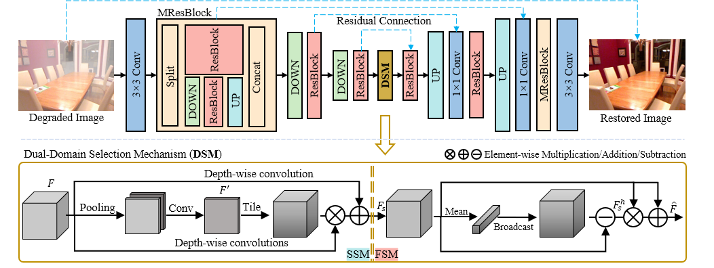

# Focal Network for Image Restoration

Yuning Cui, Wenqi Ren, Xiaochun Cao, Alois Knoll


 ## Abstract
Image restoration aims to reconstruct a sharp image from its degraded counterpart, which plays an important role in many fields. Recently, Transformer models have achieved promising performance on various image restoration tasks. However, their quadratic complexity remains an intractable issue for practical applications. The aim of this study is to develop an efficient and effective framework for image restoration. Inspired by the fact that different regions in a corrupted image always undergo degradations in various degrees, we propose to focus more on the important areas for reconstruction. To this end, we introduce a dualdomain selection mechanism to emphasize crucial information for restoration, such as edge signals and hard regions. In addition, we split high-resolution features to insert multiscale receptive fields into the network, which improves both efficiency and performance. Finally, the proposed network, dubbed FocalNet, is built by incorporating these designs into a U-shaped backbone. Extensive experiments demonstrate that our model achieves state-of-the-art performance on ten datasets for three tasks, including single-image defocus deblurring, image dehazing, and image desnowing 
 ## Architecture 


## Installation
For installing, follow these instructions:

```sh
conda create -n forcalnet -y python=3.11
conda activate forcalnet
pip install -r requirements.txt
```
### Download the Datasets
- reside-indoor [[gdrive](https://drive.google.com/drive/folders/1pbtfTp29j7Ip-mRzDpMpyopCfXd-ZJhC?usp=sharing), [Baidu](https://pan.baidu.com/s/1jD-TU0wdtSoEb4ki-Cut2A?pwd=1lr0)]

### Train on RESIDE-Indoor

```sh
python main.py --mode train --data_dir datasets/reside-indoor
```

### Evaluation
#### Download the model [here](https://drive.google.com/drive/folders/1HXCwpDbzRL9KLc9XPhUPf2YisS_1wDxo?usp=sharing)
#### Testing on SOTS-Indoor
```sh
python main.py --data_dir datasets/reside-indoor --test_model models/model_its.pkl --device [cuda,mps,cpu]
```

For training and testing, your directory structure should look like this

`datasets` <br/>
`├──reside-indoor` <br/>
     `├──train`  <br/>
          `├──gt`  <br/>
          `└──hazy`  
     `└──test`  <br/>
          `├──gt`  <br/>
          `└──hazy`  

## Results
The resulting images can be downloaded [here](https://drive.google.com/drive/folders/1GWgeqDuqJmR_3wy985l6Jl_ExtC3uFI_?usp=sharing).
|Task|Dataset|PSNR|SSIM|
|----|------|-----|----|
|**Image Dehazing**|ITS|40.82|0.996|
||OTS|37.71|0.995|
||Dense-Haze|17.07|0.63|
||NH-HAZE|20.43|0.79|
||O-HAZE|25.50|0.94|
||NHR|25.35|0.969|
|**Image Desnowing**|CSD|37.18|0.99|
||SRRS|31.34|0.98|
||Snow100K|33.53|0.95|
|**Image Motion Deblurring**|GoPro|33.10|0.962|


## Citation
If you find this project useful for your research, please consider citing:
~~~
@inproceedings{cui2023focal,
  title={Focal Network for Image Restoration},
  author={Cui, Yuning and Ren, Wenqi and Cao, Xiaochun and Knoll, Alois},
  booktitle={Proceedings of the IEEE/CVF International Conference on Computer Vision},
  pages={13001--13011},
  year={2023}
}
~~~
## Contact
Should you have any question, please contact Yuning Cui.
